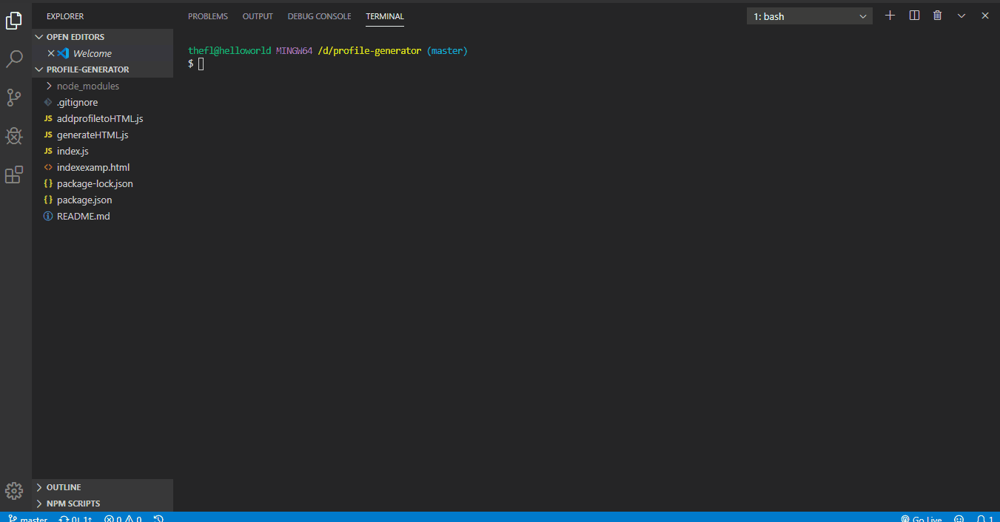

# PDF Github Resume Generator

## What it is

This is a local node application that will take user input to find a GitHub user and output key information from their profile to a pdf resume.

## Where it is

The application files can be downloaded to your local machine using:

git clone <https://github.com/JulieT2319/profile-generator.git>

## How to use it

Using your cli, cd into the application folder.

npm i

After the required packages have installed, run the program using the command:

node index.js

Answer the prompts provided.

The program will generate the pdf to the application folder.
